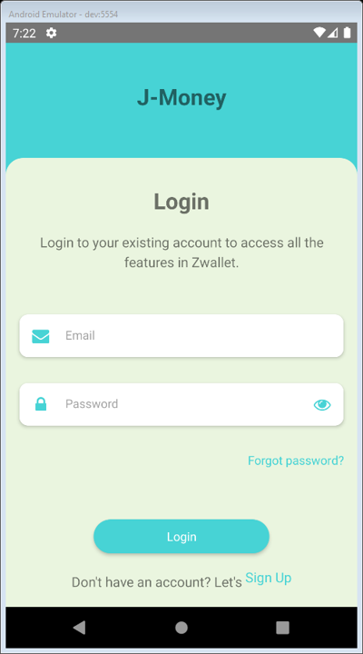
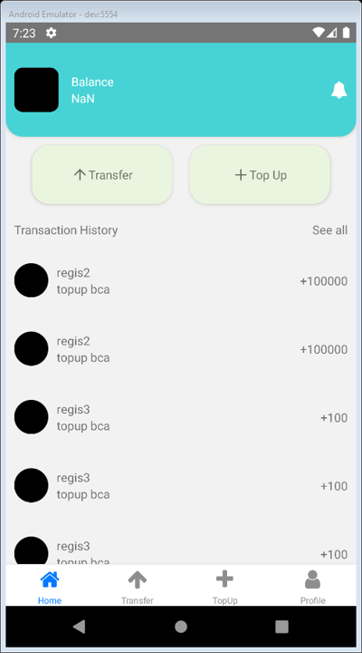
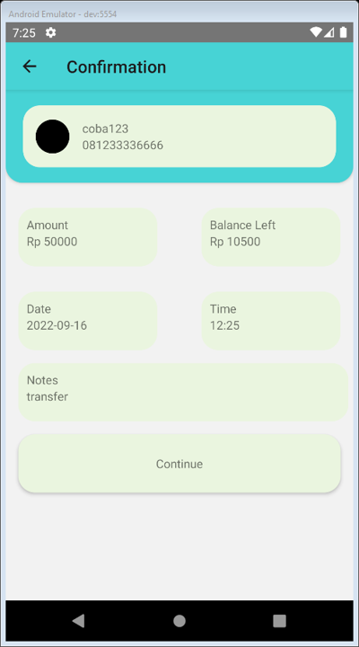
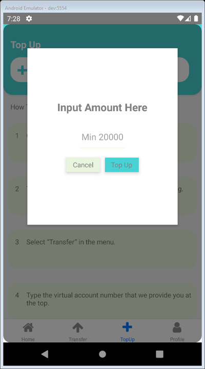
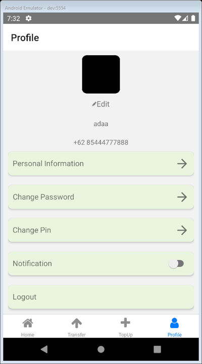

# J-Wallet | React-Native
## About
#### Mobile E-wallet app for transfer money and topup money bult using react native
#
## Feature
#### Login
#### Register
#### Transfer
#### TopUp
#### Edit Profile
#
## Built With
#### [React Native](https://reactnative.dev/)
#
## Requirement
#### [Node js](https://nodejs.org/)
#### Node_module npm i or yarn add
# 
## Getting Started
#### Clone this repo to your local computer or `git clone https://github.com/HimawanArifSM/JMoney-ReactNative`
#### Open this project in your code editor and type `npm i` or `yarn add` in terminal
#### create .env file and setup your backend url (example [BACKEND_URL=(your backend url) or [here](https://fw9-backend-nine.vercel.app/)])
#### Run `npm start and npm android` or `yarn start yarn android` on terminal
#
## Acknowledgements
#### [Axios](https://axios-http.com/)
#### [React-redux](https://react-redux.js.org/)
#
## Screenshot

